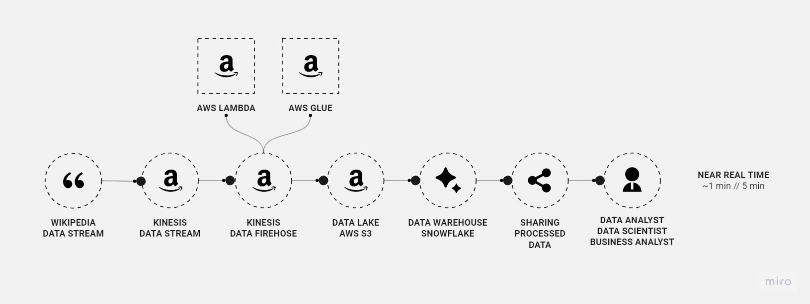
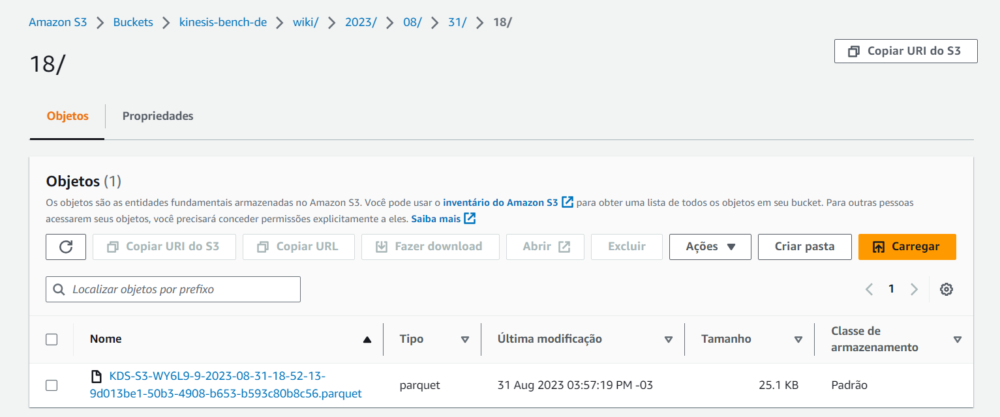
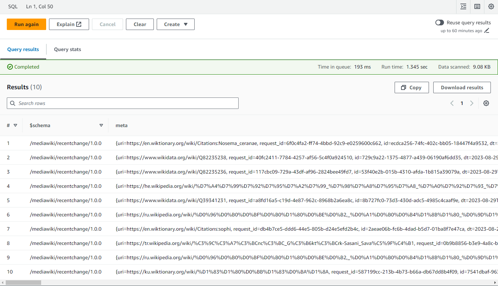
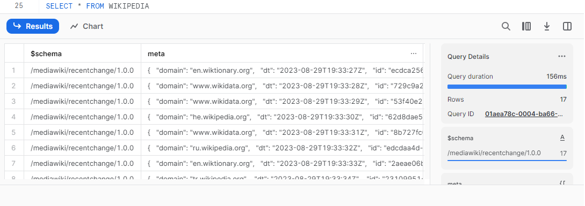

# Real-time Wikipedia Data Streaming Project
The Real-time Wikipedia Data Streaming Project is designed to capture and process real-time data from the Wikipedia Data Stream. It uses AWS Kinesis, a powerful data streaming platform, to ingest, process, and distribute Wikipedia data. This README provides an overview of the project, its components, and instructions for setting it up.

Keywords: Python, AWS Kinesis, AWS Firehose, AWS Lambda, Snowflake, AWS S3, AWS Athena

### Components
The project consists of the following components:

* AWS Kinesis Data Stream: Ingests data from the Wikipedia Data Stream.
* AWS Firehose: Ingest data from Kinesis to AWS S3.
* AWS S3: Stores raw and processed data.
* AWS Athena: Allows SQL-based querying of data stored in S3.
* AWS Glue Crawler: Creates sthe schema of the table.
* Snowflake Data Warehouse: Stores structured and transformed data for analytics.

### Prerequisites
Before you begin, ensure you have the following prerequisites in place:

- AWS account with appropriate permissions.
- AWS CLI installed and configured.
- Python 3.x installed (for Lambda functions development).
- Snowflake account and credentials (if using Snowflake).
- A basic understanding of AWS Kinesis and AWS Lambda.

### Configuration
1. Set up an AWS Kinesis Data Stream and configure the necessary AWS resources (IAM roles, etc.) for your project.
2. Configure your AWS credentials using the AWS CLI: `aws configure`
3. Set up AWS Athena and Snowflake accounts if using these services.

### Running the Project
#### Ingest Data:
Use the provided Kafka producer or an alternative method to ingest data from the Wikipedia Data Stream into your Kinesis Data Stream.

#### Run Lambda Functions:
Deploy your Lambda functions to AWS, specifying the Kinesis stream as the trigger.

#### Transform and Store Data:
Configure the Lambda functions to transform and store data in AWS S3 and, if applicable, Snowflake.

#### Query Data:
Use AWS Athena to query data stored in S3 for ad-hoc analysis and reporting.

### License:
This project is open-source and distributed under the MIT License, allowing for collaboration and adaptation according to your requirements.

In summary, this project showcases how to use Kafka for real-time data processing and streaming, making it a valuable resource for anyone interested in building similar data streaming solutions.
